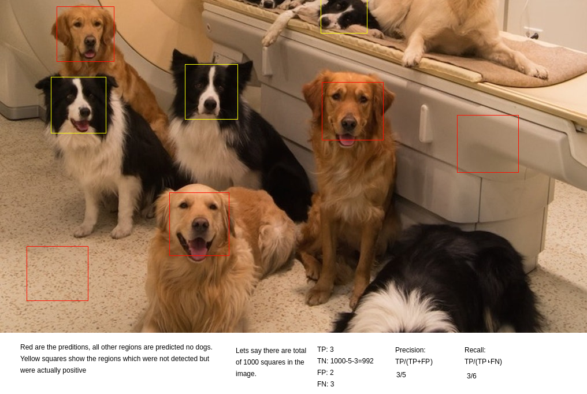

# yet-another-ml-lectures

> I have started providing some sessions(very informal) on machine learning to my fellow classmates who needed help with it. I mostly focus on mathematics and programming in pytorch. I will update my notes on a weekly basis after my session.

## Books I follow(strictly) to prepare the lecture notes
* [MML-book](https://mml-book.github.io/book/mml-book.pdf)
* [math4ml](https://gwthomas.github.io/docs/math4ml.pdf)
* [Deep Learning Book](https://www.deeplearningbook.org/)
* [Dive into Deep Learning](https://d2l.ai/d2l-en.pdf)
* [DiDL code](https://github.com/dsgiitr/d2l-pytorch)

|Week|         Topic        |     Extra notes      |
|:--:|:--------------------:|:--------------------:|
| [4](##Week 4) |Introduction          | ---      |
| [5](##Week 5) |Probability           | [Notes](https://www.dropbox.com/sh/b2e2rbc41kfi7rz/AADhtGrZbH-U-po2HBq8zCcqa?dl=0)      |
| [8](##Week 8) |Information theory, bias-variance tradeoff    | ---      |
| [9](##Week 9) |Pytorch hands-on | Code |
| [11](##Week 11) | Linear Algebra 1 | --- |
| [12](##Week 12) | Metrics for un-balanced data | --- |

--------------------------------------
## Week 4
* Introduction and the expectation from these sessions.
* Difference between classical ML approach and Deep learning approach. pros and cons.
* Importance of intuitive understanding by having basic math knowledge.
* Practical approach and importance of coding excersise. Gap between theory and practical implementation.
---------------------------------------

## Week 5
* Basics in probability
* Important descrete and continous distributions
* Self-information, mutual information, KL divergence and cross entropy.
* A good article on cross entropy theory [here](https://medium.com/@stepanulyanin/notes-on-deep-learning-theory-part-1-data-generating-process-31fdda2c8941)
* Clarification of binary and multi class cross entropy interface in pytorch
    - `torch.nn.functional.binary_cross_entropy` takes logistic sigmoid values as inputs
    - `torch.nn.functional.binary_cross_entropy_with_logits` takes logits as inputs
    - `torch.nn.functional.cross_entropy` takes logits as inputs (performs `log_softmax` internally)
    - `torch.nn.functional.nll_loss` is like `cross_entropy` but takes log-probabilities (log-softmax) values as inputs
----------------------------------------

## Week 8
* Self-information: Number of bits required to convey an event x, given by -log(p(x)).
* Self-entropy: Average uncertainity in whole probability distribution, given by E_{x~p(x)}[-log(p(x))]
* KL divergence: Measures distance between two distribution P and Q over same random variable X, given by E_{x~P}[log(P(x)/Q(x))]
* KL divergence provides extra bits of info sampled from P but using the codes designed to encode info sampled from Q.
* The characteriscs of forward KL (zero spreading) and backward KL (zero inducing) is described [here](https://wiseodd.github.io/techblog/2016/12/21/forward-reverse-kl/)
* (Advanced) Density ratio estimation in KL divergence in tensorflow [here](https://tiao.io/post/density-ratio-estimation-for-kl-divergence-minimization-between-implicit-distributions/)
* Cross-entropy: Uncertainity in a distribution Q averaged over samples from another (cross) distribution P, given by E_{x~P}[-log(Q(x))].
* Cross entropy is also equal to Self-entropy of P and KL divergence between P and Q. So, minimizing Cross entropy with respect to Q minimizes forward KL divergence between P and Q.
* Empirical distribution: Since real distribution is not available and we only get the data points sampled from real distribution, empirical distribution replaces the real distribution by putting equal probabilities on each data samples (with IID assumption).
* So cross entropy minimization often means minimizing E_{x~P_hat}[-log(Q(x))] where P_hat(x_i) = 1/N (N is the number of samples).
* Point estimators: To estimate the parameters, a point estimator is a function of random variables (signifying the data observations). For example, in neural networks, the point estimator funtion is gradient calculation plus addition.
* Bias: It is distance of estimated parameter from real parameters (which is unknown), given by E[theta] - real_theta.
* Variance: It represents the variation in parameters for small perturbation in observed data (and hence point estimation).
* MSE and bias-variance tradeoff: E[(theta - real_theta)^2] = E[(theta -E[theta] + E[theta] - real_theta)^2] = E[(theta - E[theta])^2 + (real_theta-E[theta])^2 + 2*(theta-E[theta])* (real_theta-E[theta])] = Bias^2 + Var + (real_theta - E[theta])* 0

## Week 9
* When pytorch? (cheap, easy code, not fast), when tensorflow? (production level code, very fast, established infra)
* Start with pytorch, once proof-of-concept is ready, migrate code to tensorflow.
* Structure code: refer framework test directory, ready to do a **lot** of hyper-parameter search (but not blindly).
* Debugging through visualization is very very very important. Eg. distribution plot of floats out of a layer, weights.

## Week 11
* Vector space and sub-spaces. Sub-spaces should have zero element and should follow clouser property.
* Generating set is a set of vectors that **spans** the vector space. Basis of a vector space are linearly independent vector set that spans the vector space.
* Rank is the number of linearly independent rows or linearly independent columns.
* Linear mapping (and its properties such as homo-morphism) and linear transformation matrix.
* Kernels (with relation to matrix transformation) are all vectors that are zero vectors in original vector space.
* Norms and inner-product maps V or VXV to R, where V is the vector space. They measure the length and distance.
* Orthonormal/orthogonal basis and orthogonal projection. Gram Smidt process to find such basis.

## Week 12
* True positive: hit, Red squres with dog face.
* False negative: miss, Yelow squares with dog face.
* False positive: Low skill model, Req squares without dog face.
* True negative: All regions other red and yellow squares.
* Precision: Out of positive predictions, how many were actually correct.
* Recall: Out of all actual postitive labels, how many we got.

* AUC curve measure the models skill for balanced data as we vary the probability threshold.
* Precision-recall curve summarizes the model's skill for un-balanced data where positive examples are the real concern.
